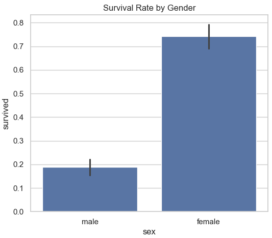
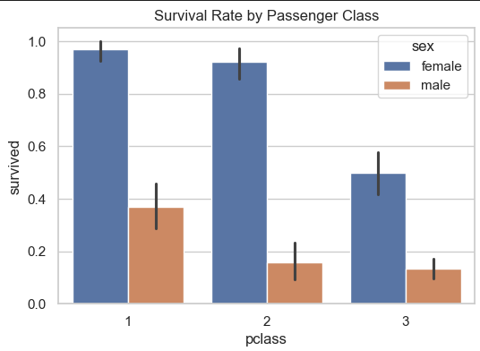

# Exploratory Data Analysis on Titanic Dataset

## Overview
This notebook explores the Titanic dataset to understand patterns and relationships in passenger survival. It’s written in a beginner-friendly way with simple, clear explanations.

## What’s Inside
1. **Explore the Dataset**  
   Loads and previews the dataset to understand the columns and basic structure.

2. **Data Cleaning**  
   Handles missing values and converts data types so the dataset is ready for analysis.

3. **Cleaned Dataset**  
   Displays the improved dataset after cleaning.

4. **Convert Datatypes**  
   Ensures numerical and categorical data are correctly formatted.

5. **Summary Statistics**  
   Generates quick stats to understand numeric and categorical data.

6. **Group-Based Insights**  
   Analyzes survival rates by categories like gender and passenger class.

7. **Visualization**  
   Creates easy-to-read plots to see patterns in survival rates.

## How to Use
- Open the notebook `python_eda.ipynb`.
- Run the cells step-by-step to explore, clean, and visualize the Titanic dataset.

## Images

- **Survival by Gender Plot:**  
  
- **Class-wise Survival Chart:**  
  
